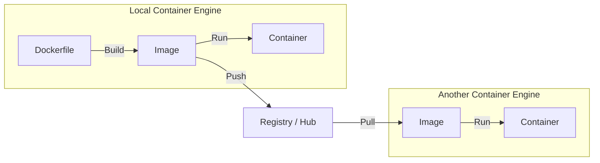

# Docker

Docker is used for packaging software so it can be sent to others without any version conflict issues.

## Reasons to use Docker

- it encapsulates everything required to run the application
- it also provides isolation by containerizing the application's instance and even deployments on a single server too (to prevent hacking spread, for example) - (virtual machines can be used to handle this too, but they're too heavy)
- it is also scalable where we can set up instances of the containers or copies of the app on other places based on our load requirements

## Components of Docker

### 1. Docker/Container Engine

- frontend is the Docker CLI
- backend is the Docker daemon which does the work
- the communication between them is done through the REST API, which is between the CLI and the daemon

### 2. Docker Images

- the executable software package that includes everything needed to run the software

#### Lifecycle

- created using the `build` command
- stored so others can pull them from there
- distributed
- execution - image is executed to run it on devices

### 3. Dockerfile

- series of instructions to build the image
- the daemon reads it and creates the image
- contains instructions like: `FROM`, `LABEL`, `RUN`, `COPY`, `ENV`, `EXPOSE`, `WORKDIR`, etc.

#### Components of a Dockerfile

- base image
- which files to add to the Docker image
- working directory
- ports to expose, etc.

### 4. Docker Container

- the instance of a Docker image is called a Docker container
- when image --- (built, distributed, downloaded, executed) ---> container

### 5. Docker Registry

- the place where Docker images can be pushed and pulled
- example registries: Docker Hub
- like GitHub, private and public repositories (Docker images) can be set up
- each repository can have different tags (versions) - also like GitHub
